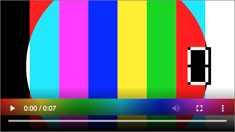

You may have noticed that the number of platforms for tutorials, vlogging, streaming, ADs, shows, and series has been growing fast. The decrease of relative prices for streaming devices like smartphones, smart TVs, combined with stable internet connection availability, helped to boost the demand for video content significantly. Since the industry started to grow, it naturally requires more people to keep it afloat. And I am one of those people - a video engineer.

I have been doing this for five years already, and I have always found it challenging to find useful information about working with video on the web. This is why I decided to write a series of articles to share my experience on how the video works, and I hope it can serve as a solid source of knowledge.

This first article will be dedicated to the HTML5 video tag and its basic usage on the web.

## HTML Video element

The simplest example we can start with is adding a video tag ([video element, specification section](https://html.spec.whatwg.org/multipage/media.html#the-video-element)) to the HTML code. Adding the following code snippet to your markup code will show a player on the web-page and will allow it to play if the browser supports the content-type:

```html
<video controls src="testsrc-720p-24fps.mp4" width="480" />
```

Result screenshot (on macOS Catalina using Google Chrome browser v83):


As you may see, we have used multiple attributes of the `<video />` tag. One of them is `controls`. If present, the out-of-the-box browser will offer UI to control video playback (play, pause), current playback position and duration, progress bar, seeking, volume control, download, toggle full-screen mode, toggle closed captions, and toggle the picture in picture mode.

### APIs and Events

Because the video tag is a media element, it has various [APIs](https://html.spec.whatwg.org/multipage/media.html#htmlmediaelement) and [events](https://html.spec.whatwg.org/multipage/media.html#mediaevents) which are accessible through JavaScript:

```javascript
// Adding some event listeners
elVideo.addEventListener('volumechange', console.log);
elVideo.addEventListener('pause', console.log);

// Calling method `pause`, pause the playback
elVideo.pause();

// Getting volume level
elVideo.volume;
// Setting volume level
elVideo.volume = 0.5;
```

A good demonstration of HTML5 Video APIs and Events could be found on [w3.org page](https://www.w3.org/2010/05/video/mediaevents.html).

### What is next

Most video players we see now on the web, and other platforms have a custom UI and different sophisticated features on top of the video tag. For example, live streaming, advertising support, closed captions, auto-switching between qualities, and chapters (one of the new features YouTube has). To be able to implement the functionality described above as well as something new, we need to learn more specifications. A good specification to start with would be Media Source Extensions (MSE), which will be the topic we will dig into next.

#video-tech, #video, #html, #javascript, #MSE, #streaming
